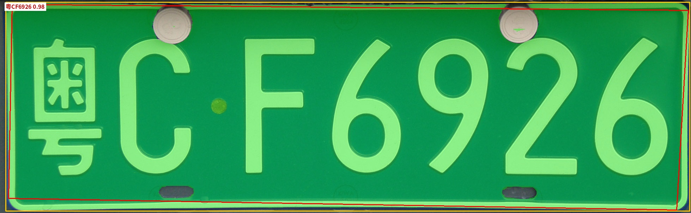
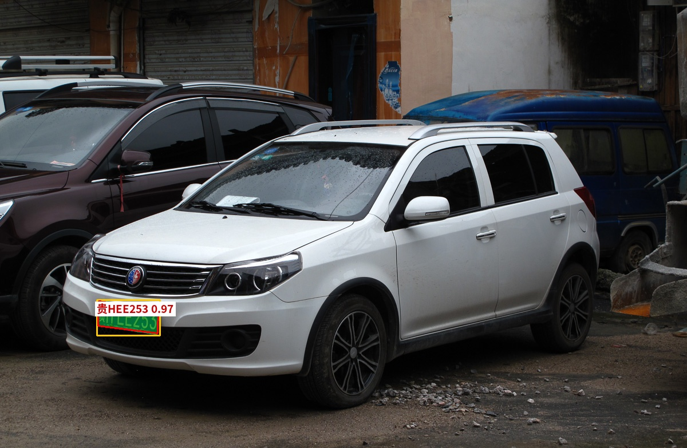

# platesam

**License plate recognition** — SAM 3 text-prompt segmentation → perspective rectification
to the plate's real shape → PaddleOCR.

Built as a course project, validated end-to-end on an **Intel XPU** laptop (WSL2, no CUDA).

```text
             ┌──────────────────────────────┐
 image ────► │ 1. SAM 3 segmentation        │  text prompt: "license plate"
             │    (open-vocabulary mask)    │  merged over several prompt candidates
             └──────────────┬───────────────┘
                            │ binary mask
             ┌──────────────▼───────────────┐
             │ 2. Rectification             │  mask → largest contour → 4 corners
             │    warp to 440×140 (mm)      │  (minAreaRect fallback, 90° auto-rotate)
             └──────────────┬───────────────┘
                            │ frontal plate crop
             ┌──────────────▼───────────────┐
             │ 3. PaddleOCR recognition     │  text normalization + validity check
             └──────────────┬───────────────┘
                            ▼
                 results.json + viz/*.jpg + crops/*.jpg
```

## Demo

<table>
<tr>
<td width="50%"><br><code>粤CF6926</code> · text score 0.98 · det score 0.95</td>
<td width="50%"><br><code>贵HEE253</code> · text score 0.97 · det score 0.94</td>
</tr>
</table>

Measured on the sample images (Intel XPU, bf16 autocast, ~4 GB peak memory):

| Image | Prompt | Detection | OCR | Time |
| --- | --- | --- | --- | --- |
| `assets/samples/guangdong_plate.jpg` (plate close-up) | `license plate` | 0.95 | `粤CF6926` (0.98, valid) | 2.2 s |
| `assets/samples/geely_kingkong.jpg` (car in street) | `license plate` | 0.94 | `贵HEE253` (0.97, valid) | 2.4 s |
| `assets/samples/byd_surui.jpg` (extreme side view) | `license plate` | 0.89 | `JGS503` (0.99, **invalid** — info lost) | 20 s¹ |

¹ The plate is nearly edge-on and cropped by the image border, so the zoom fallback kicks in.
The result is flagged `"valid": false` in the JSON.

## Features

- **XPU first**: runs natively on Intel XPU (`torch 2.14.0+xpu`), no CUDA required; falls back
  to CUDA/CPU automatically. Includes a documented set of upstream patches (see below).
- **Open-vocabulary segmentation**: no plate detector to train — SAM 3 finds plates from
  text prompts alone.
- **Multi-prompt merge**: several English prompt candidates are run and merged by mask IoU
  (`license plate`, `number plate`, `vehicle registration plate`, `car plate`).
- **Fixed-prompt text cache**: all fixed pipeline prompts (the four plate candidates plus
  `car`) are encoded once at load and reused for every image — see
  [Fixed-prompt text cache](#fixed-prompt-text-cache).
- **Optional vision-backbone compile**: `--compile-vision` wraps the ViT trunk in
  `torch.compile` for ~1.11× vision / ~1.08× segmentation on XPU; eager stays the default —
  see [Optional vision-backbone `torch.compile`](#optional-vision-backbone-torchcompile).
- **Coarse-to-fine fallback**: if the full-frame pass finds nothing, vehicles are located with
  the `car` prompt, cropped with margin, upscaled, and re-run; last resort is the bottom half.
- **Geometry-aware rectification**: contour → quad (`approxPolyDP`, `minAreaRect` fallback) →
  perspective warp to the canonical 440×140 mm single-row plate aspect, with 90° auto-rotation
  for vertical detections and a small inset to drop plate frames.
- **OCR post-processing**: full-width → half-width, common confusions (`I`→`1`, `O`→`0`),
  and Chinese plate-format validation (standard 7-char and new-energy 8-char patterns).
- **Usable outputs**: per-image JSON, annotated visualization with CJK labels, and rectified crops.

## Repository layout

```text
├── src/lpnrecog/            # project code (MIT)
│   ├── segmenter.py         #   SAM3 wrapper: devices, prompts, merge, zoom fallback
│   ├── rectify.py           #   mask → quad → 440×140 warp (pure OpenCV, unit-tested)
│   ├── ocr.py               #   PaddleOCR wrapper + text normalization/validation
│   ├── pipeline.py          #   end-to-end pipeline
│   ├── viz.py               #   mask overlay, box/quad, CJK-aware labels
│   ├── cli.py               #   command line interface
│   ├── device.py            #   device selection + bf16 autocast helpers
│   └── types.py             #   dataclasses (detections / results)
├── vendor/sam3/             # upstream SAM 3, nested .git removed, XPU patches applied
│   └── weights/master/      # sam3.pt checkpoint (gitignored, download separately)
├── assets/samples/          # demo images (Wikimedia Commons, see Licensing)
├── docs/                    # README figures
├── scripts/                 # weight download, benchmarks/profiler, evaluator
└── tests/                   # pytest unit tests
```

## Requirements

| Item | Tested / required |
| --- | --- |
| OS | Linux (developed on WSL2, kernel 6.18) |
| Hardware | Intel XPU (iGPU/dGPU with Level Zero); CUDA GPU or CPU also work |
| Python | 3.10–3.12 (tested on 3.12) |
| PyTorch | 2.14.0+xpu + torchvision 0.29.0+xpu (CUDA/CPU builds also fine) |
| Paddle | paddlepaddle 3.3.1 + paddleocr 3.7.0 (CPU) |
| Disk | ~10 GB (3.4 GB checkpoint + models + env) |
| Memory | ≥8 GB RAM; XPU inference peaks at ~4 GB |

## Installation

The reference environment is a conda env named `sam3`. To rebuild it from scratch:

```bash
conda create -n sam3 python=3.12 -y
conda activate sam3

# 1) PyTorch for Intel XPU (or use the official CUDA/CPU index for other hardware)
pip install torch torchvision --index-url https://download.pytorch.org/whl/xpu

# 2) Vendored SAM 3 and this project (editable, no dependency resolution side effects)
pip install -e vendor/sam3 --no-deps
pip install -e . --no-deps

# 3) Runtime dependencies
pip install "numpy<2" opencv-python-headless pillow \
            paddlepaddle paddleocr \
            einops pycocotools psutil pytest
```

> **Note:** `paddleocr` pulls `opencv-contrib-python`; keep `numpy<2` (SAM 3 requires it).
> If `import sam3` fails with `ModuleNotFoundError: pkg_resources`, you are running the
> unpatched upstream code — this repo already replaced it with `importlib.resources`.

## Model weights

`lpnrecog` needs the **native checkpoint** `sam3.pt` (3.45 GB), not the HF `model.safetensors`
(that one is for the `transformers` integration and is not used here).

Expected location:

```text
vendor/sam3/weights/master/
├── sam3.pt      3.45 GB   required  (native checkpoint)
└── config.json  25.8 KB   optional  (model metadata)
```

### Option A — ModelScope (recommended, no login)

```bash
bash scripts/download_sam3_weights.sh               # default: ModelScope → vendor/sam3/weights/master
# or explicitly:
bash scripts/download_sam3_weights.sh --source ms /data/weights
```

### Option B — HuggingFace (gated)

Accept the license at <https://huggingface.co/facebook/sam3>, then:

```bash
hf auth login
bash scripts/download_sam3_weights.sh --source hf
```

### Option C — manual / existing copy

Any directory works:

```bash
export LPNRECOG_SAM3_CKPT=/path/to/sam3.pt
python -m lpnrecog --checkpoint /path/to/sam3.pt -i ...
```

### Verify

```bash
ls -lh vendor/sam3/weights/master/sam3.pt
# sha256 (ModelScope / HF mirror, this revision):
#   9999e2341ceef5e136daa386eecb55cb414446a00ac2b55eb2dfd2f7c3cf8c9e
```

## Quick start

```bash
conda activate sam3

# whole sample directory
python -m lpnrecog -i assets/samples -o outputs/demo --conf 0.3 --prompt "license plate"

# expected:
#   geely_kingkong.jpg:  1 plate(s) -> 贵HEE253(0.97)
#   guangdong_plate.jpg: 1 plate(s) -> 粤CF6926(0.98)
#   byd_surui.jpg:       1 plate(s) -> JGS503(0.99,invalid)
#   results written to outputs/demo/results.json
```

Outputs:

```text
outputs/demo/
├── results.json            # machine-readable results
├── viz/<name>_viz.jpg      # annotated image (mask, quad, plate text)
└── crops/<name>_plate0.jpg # rectified 440×140 plate crops
```

Python API:

```python
from lpnrecog import PlateRecognitionPipeline
from lpnrecog.ocr import is_valid_plate

pipe = PlateRecognitionPipeline()          # device auto: xpu > cuda > cpu
for res in pipe.run("assets/samples/geely_kingkong.jpg"):
    print(res.text, res.text_score, res.box, is_valid_plate(res.text))
    # 贵HEE253 0.9691 (169.0, 524.2, 278.7, 585.5) True
```

## CLI reference

```text
python -m lpnrecog -i INPUT [-o OUTPUT] [options]
```

| Flag | Default | Description |
| --- | --- | --- |
| `-i, --input` | required | image file or directory (searched recursively) |
| `-o, --output` | `outputs` | output directory |
| `--prompt` | `license plate`, `number plate`, `vehicle registration plate`, `car plate` | SAM3 text prompt; repeatable |
| `--conf` | `0.4` | detection score threshold |
| `--device` | auto | `xpu` / `cuda` / `cpu` |
| `--checkpoint` | `vendor/sam3/weights/master/sam3.pt` | SAM3 checkpoint path |
| `--plate-size` | `440x140` | rectified crop size `WxH` |
| `--no-viz` | off | skip annotated images |
| `--no-crops` | off | skip rectified crops |
| `--json` | `<output>/results.json` | results JSON path |
| `--compile-vision` | off | `torch.compile` the ViT trunk (first run pays compilation) |
| `--compile-vision-mode` | `default` | `torch.compile` mode (`default` / `reduce-overhead`) |
| `--compile-vision-target` | `trunk` | what to compile: `trunk` / `vision_backbone` / `forward_image` |

### results.json format

```json
[
  {
    "image": "assets/samples/geely_kingkong.jpg",
    "elapsed_s": 2.39,
    "plates": [
      {
        "box": [169.0, 524.2, 278.7, 585.5],
        "det_score": 0.9414,
        "prompt": "license plate",
        "text": "贵HEE253",
        "text_score": 0.9691,
        "valid": true
      }
    ]
  }
]
```

## How it works

### 1. Segmentation (`segmenter.py`)

- SAM 3 is loaded lazily from the local checkpoint (`build_sam3_image_model`, no HF download).
- `set_image` runs once per image; every prompt then runs a cheap grounding pass and the
  detections are merged by mask IoU (score-sorted greedy NMS).
- Candidates are filtered by mask area, bounding-box aspect ratio, and mask fill ratio
  (plate-shaped detections only).
- **Fallback zoom**: when the full-frame pass returns nothing — small or foreshortened plates —
  the `car` prompt locates vehicles, each is cropped with 25% margin, upscaled to 1008 px, and
  re-run through the plate prompts; masks are mapped back to full-image coordinates.

#### Fixed-prompt text cache

Every prompt the pipeline can issue is a fixed string, so their SAM 3 text-encoder outputs
(`language_features`, `language_mask`, `language_embeds`) are computed **once** in
`PlateSegmenter.load()` via the existing `backbone.forward_text(...)` and reused by every
grounding pass — including the `car` prompt used by the zoom fallback:

`license plate` · `number plate` · `vehicle registration plate` · `car plate` · `car`

The full `segment()` path runs under `torch.inference_mode()` (matching the original
`Sam3Processor.set_text_prompt()`), so cached grounding stays inference-only. The generic path
is untouched: any custom prompt still runs the text encoder through
`Sam3Processor.set_text_prompt`, and `segmenter.use_text_cache = False` restores the original
behavior. Caching all five prompts costs ~0.3 s once at load (5 × ~60 ms) and removes ~60 ms
per prompt from every inference (~0.25 s per default 4-prompt image).

Correctness: cached vs uncached outputs match exactly on all three sample images (detection
count, boxes, scores, mask IoU = 1.0, OCR text/scores), and a full result dump — including
mask SHA-256 hashes — of the previous revision matches bit-for-bit.

#### Stage-level XPU profile

Measured with `scripts/profile_xpu_pipeline.py --runs 5` on an Intel XPU laptop
(`torch 2.14.0+xpu`, bf16 autocast, 1008² input, `guangdong_plate.jpg`). Accelerator stages
are timed with `torch.xpu.synchronize()`; values are medians over 5 runs after warmup.

| stage | single prompt | default 4 prompts | share (default) |
| --- | ---: | ---: | ---: |
| image load (`imread`) | 3.9 ms | 3.7 ms | 0.1% |
| preprocess (to PIL) | 5.4 ms | 5.4 ms | 0.2% |
| **set_image (transform + ViT)** | **1241 ms** | **1212 ms** | **46.0%** |
| grounding: `license plate` | 234 ms | 236 ms | 9.0% |
| grounding: `number plate` | — | 229 ms | 8.7% |
| grounding: `vehicle registration plate` | — | 224 ms | 8.5% |
| grounding: `car plate` | — | 228 ms | 8.7% |
| mask upsample (`interpolate`) | 0.2 ms | 0.9 ms | 0.0% |
| XPU→CPU extract (scores/boxes/masks) | 2.9 ms | 11.7 ms | 0.4% |
| filter (shape) | 1.2 ms | 3.8 ms | 0.1% |
| NMS merge (mask IoU) | 0.0 ms | 3.1 ms | 0.1% |
| **segment total** | **1475 ms** | **2159 ms** | **82.0%** |
| rectify | 2.8 ms | 2.3 ms | 0.1% |
| OCR (PaddleOCR, CPU) | 420 ms | 415 ms | 15.8% |
| **pipeline total** | **1936 ms** | **2633 ms** | 100% |

The remaining bottleneck is the 1008² vision backbone (~1.2 s) plus one ~230 ms grounding
pass per prompt. Everything after the masks leave the XPU — normalization, mask upsampling,
D2H transfer, shape filtering, mask-IoU NMS, rectification — is below 1% each, so further work
has to target the image encoder or prompt batching; this round changes neither.

#### Optional vision-backbone `torch.compile`

`PlateSegmenter(compile_vision=True)` (CLI `--compile-vision`) wraps the **ViT trunk** in
`torch.compile(mode="default", dynamic=False, fullgraph=True)`. Eager remains the default and
the optimization is reversible; weights, resolution (1008²), prompt set and bf16 policy are
untouched.

Benchmarked with `scripts/benchmark_compile.py --runs 3 --cycles 5` (60 s conditioning, then
interleaved eager/compiled blocks; medians, `guangdong_plate.jpg`, default 4 prompts):

| | eager | compiled | speedup |
| --- | ---: | ---: | ---: |
| ViT / vision forward | 1231 ms | 1088 ms | **1.11×** |
| full SAM3 segmentation | 2329 ms | 2101 ms | **1.08×** |
| full pipeline (+rectify+OCR) | 2797 ms | 2646 ms | 1.06× |
| peak XPU memory | 3.98 GB | 3.98 GB | — |
| compile + first vision call (cold / warm inductor cache) | — | 34.3 s / 5.6 s | — |

*(latencies: median over blocks; speedups: median of paired per-cycle eager/compiled ratios.)*

Boundaries and modes tested (`--target`, `--mode`): the ViT trunk is the best boundary — the
whole `vision_backbone` (trunk + fused neck + position encoding) is *slower* compiled
(~0.93×), and full `forward_image` is on par with the trunk (~1.10× vision). `reduce-overhead`
measures the same as `default` because cudagraphs are skipped on XPU, and `max-autotune` is
unstable (see limitations).

Correctness (eager vs compiled): detection count identical on all samples; geely/BYD masks
bit-exact, guangdong differs on 0.012% of mask pixels (mask IoU 0.9999, boxes ≤ 0.43 px,
scores ≤ 0.004) because compiled kernels reorder bf16 reductions and the final 0.5 logit
threshold lands a few pixels differently. OCR strings are identical on all three images
(guangdong text score: compiled 0.9903 vs eager 0.9806). Compilation is therefore **not
bit-exact** like the text cache, but detection/mask/OCR semantics are preserved.

Compiler notes (torch 2.14.0+xpu, triton-xpu 3.8.0):

- The vision path captures as a **single Dynamo graph with 0 graph breaks** for all three
  boundaries (`torch._dynamo.explain`); RoPE, window partition/unpartition, position
  encodings and `addmm_act` do not introduce breaks.
- RoPE still hurts: it uses `torch.view_as_complex`/`view_as_real`, which inductor cannot
  codegen on XPU (warning *"Torchinductor does not support code generation for complex
  operators"*), so that subgraph falls back to eager and caps the win.
- `mode="max-autotune"` is unstable on this stack: a Triton matmul config exceeds the
  per-thread scratch-space limit and the compile subprocess **segfaults**.
- `mode="reduce-overhead"` skips cudagraphs on XPU (*"skipping cudagraphs due to multiple
  devices"*), so it offers no advantage over `default`.
- Compile cost is paid once per process; subsequent runs reuse the inductor disk cache
  (34 s cold → 5.6 s warm for the trunk).

### 2. Rectification (`rectify.py`)

- Largest contour of the mask → `approxPolyDP`, falling back to `minAreaRect`.
- Corners are ordered `tl, tr, br, bl`, shrunk 2% toward the centroid (drops plate frames),
  and warped to **440×140** — the real-world single-row blue plate (440 mm × 140 mm, ~3.14:1)
  — so OCR sees a frontal, axis-aligned plate.
- Vertical detections are rotated back to landscape automatically.

### 3. OCR (`ocr.py`)

- PaddleOCR (`lang="ch"`, doc-orientation/unwarping disabled for speed,
  `enable_mkldnn=False` to work around a paddle 3.3 + oneDNN PIR bug).
- The 180°-rotated crop is also tried (rectification cannot always determine "up"); the
  higher-scoring, format-valid result wins.
- Text is normalized (NFKC, upper-case, confusion map) and validated against Chinese plate
  patterns (standard 7-char, new-energy 8-char).

## Benchmark evaluation

`scripts/evaluate_benchmark.py` runs the full pipeline over the frozen
[`benchmark_data`](benchmark_data/README.md) v1.0 set (50 images: 10 each of normal / angle /
small / blur / lighting; 42 blue + 8 new-energy plates) and scores recognition against
`ground_truth.csv`. Default settings on the XPU laptop:

| metric | result |
| --- | ---: |
| detected (≥1 plate) | 50/50 (100%) |
| exact plate match (top-1 / any) | 31/50 (62%) |
| valid plate format | 33/50 (66%) |
| mean character accuracy | 81.2% |
| latency | median 2.44 s, total 145 s |

| category | exact | | plate type | exact |
| --- | ---: | --- | --- | ---: |
| normal | 8/10 | | blue | 25/42 |
| angle | 8/10 | | new-energy | 6/8 |
| small | 4/10 | | | |
| blur | 6/10 | | | |
| lighting | 5/10 | | | |

The dominant failure mode is the leading province/prefix glyphs: 13 of the 19 misses lose,
misread or garble them (`冀A85A68`→`冀`, `苏A61L77`→`A61L77`, `鲁BF05876`→`F05876`, …), 4 images
produce an empty OCR string, one misreads `豫AD06809` as `皖AD06809`, and one confuses `1`/`L`.
SAM3 finds a plate in every image, so the remaining errors sit in rectification/OCR, not
detection.

Eager vs compiled (`--compare`): recognition verdict identical on all 50 images, top-1 text
identical on 49/50 (the one difference is wrong in both runs, `PF` vs `号`), detection count
identical on 49/50, mask IoU median 0.9996 (min 0.972, 48/49 ≥ 0.99) and max text-score drift
0.019. The compiled vision backbone does not change which plates are read correctly.

Reproduce:

```bash
python scripts/evaluate_benchmark.py                 # eager accuracy report
python scripts/evaluate_benchmark.py --compare       # + eager/compiled agreement
```

## XPU port (changes vs upstream SAM 3)

| File | Change |
| --- | --- |
| `sam3/model_builder.py` | `importlib.resources` replaces the removed `pkg_resources`; new `_best_device()` (xpu > cuda > cpu); `_setup_device_and_mode` accepts any device |
| `sam3/model/decoder.py` | removed hardcoded `device="cuda"` coordinate precompute at init; coords are built lazily on the input device |
| `sam3/model/position_encoding.py` | precomputed position-encoding cache is built on CPU and moved to the input device on forward |
| `sam3/perflib/fused.py` | `addmm_act` follows the input dtype instead of hardcoding bf16 (identical under bf16 autocast) |
| `sam3/model/sam3_image_processor.py` | `Sam3Processor` defaults its device to the model's device |

Inference on XPU uses `torch.autocast("xpu", dtype=torch.bfloat16)` (equivalent to the official
notebook's CUDA bf16); plain fp32 global attention at 1008² input would need ~18 GB and OOMs.

## Troubleshooting

| Symptom | Fix |
| --- | --- |
| `ModuleNotFoundError: pkg_resources` | Use this repo's patched `vendor/sam3` (`pip install -e vendor/sam3 --no-deps`) |
| `RuntimeError: Torch not compiled with CUDA enabled` | You are on unpatched upstream code; this repo removes the hardcoded CUDA device |
| `torch.OutOfMemoryError: XPU out of memory` | Ensure inference runs under `bf16_autocast` (the pipeline does); close other GPU apps |
| `NotImplementedError: ConvertPirAttribute2RuntimeAttribute ...` (Paddle) | `PlateOCR` already sets `enable_mkldnn=False`; do not override it |
| `Can't initialize Level Zero Sysman` warning | Harmless WSL2 driver warning from `torch.xpu` |
| `CUDA is not available ... Disabling autocast` warnings from video modules | Harmless: video-only decorators; the image pipeline does not use them |
| Plate not detected on a full car photo | Lower `--conf`, or rely on the automatic vehicle-crop zoom fallback |

## Testing

```bash
pytest -m "not slow"    # rectification geometry + text post-processing (no models needed)
pytest -m slow          # PaddleOCR smoke test on a synthetic plate (downloads OCR models)

# fixed-prompt cache: output equivalence + latency + peak XPU memory
python scripts/benchmark_text_cache.py --runs 5

# stage-level XPU profile (single + default prompts) with cached/uncached verification
python scripts/profile_xpu_pipeline.py --runs 5

# eager vs torch.compile: interleaved latency + equivalence (vision/detections/OCR)
python scripts/benchmark_compile.py --runs 3 --cycles 5
python scripts/benchmark_compile.py --verify-only assets/samples/*.jpg

# accuracy on the frozen benchmark_data v1.0 set (+ eager/compiled agreement)
python scripts/evaluate_benchmark.py --compare
```

## Known limitations

- Extreme side views / plates cut by the image border lose too much information; OCR may return
  an invalid string (flagged `"valid": false`).
- Only the single-row 440×140 plate geometry is modeled; double-row yellow plates (440×220)
  and green new-energy plates would need another branch.
- PaddleOCR runs on CPU here; the XPU is used for SAM 3 only.
- No batch inference yet: images are processed one by one (model and OCR are loaded once).
- `--compile-vision` reorders bf16 reductions in the compiled kernels, so it is only
  equivalence-level accurate (masks/OCR stable, not bit-exact); the default eager path is
  bit-exact. `max-autotune` is currently unusable on XPU (Triton scratch-space OOM → segfault).

## License and attribution

- `vendor/sam3/` is Meta's SAM 3 code, redistributed under the **SAM License**
  (copy kept at [`vendor/sam3/LICENSE`](vendor/sam3/LICENSE) as required). Restrictions apply
  (e.g. no military/warfare use, no reverse engineering). **Model weights are not committed.**
  If you publish research using SAM 3, acknowledge it.
- Everything outside `vendor/sam3/` (`src/`, `tests/`, `scripts/`) is **MIT** licensed,
  see [`LICENSE`](LICENSE).
- Demo images in `assets/samples/` are from Wikimedia Commons — BYD Surui, Geely King Kong Cross
  in China, and 粵 license plate of Guangdong — under their respective CC licenses, used for
  demonstration only.
- PaddleOCR is provided by the PaddlePaddle project under Apache-2.0.
